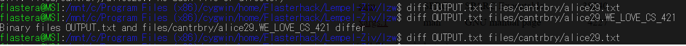

# LZW Implememtation in C++ 
## Alex Richter & Ariel Flaster

### to run this, do 
`make`

Please let me know if you need help using the makefile, David. 

Then do 
`./lz [filename]` to run.

We have files in our files directory, so 
`./lz files/davidcopperfield.txt` 
is something you can actually type. The outputted file will be saved as filename.WE_LOVE_CS_421 and it will be in the same directory as the original file. 

When it decompresses, it will decompress to OUTPUT.txt in the same directory as lzw. It WON'T be in the same directory as your file, only the compressed file will end up there.

## Compression
Start by constructing the table  with the ASCII characters in the first 256 entries. Get the first character and then since it with is only a single character it is in the table so we want to see if that plus the next character is in the 
table which it is not, so then we are going to add that to the new table and increment the size of the table. Note that newcode is a counter to make sure that we don’t go past the number of possible substrings. If we reach that condition, then we want to just encode the text using the values in the table and stop expanding the table. The encoded sequence is then outputted to file. 

## Decompression
Build the same dictionary and then we want to search through the dictionary to find the characters. This function will read in an encoded file and then we will write a decompressed version. 
We read in the first value which is a number in ASCII so we look it up in the table we have created. Then we go and check if the next character can be read. If it is a value greater than the table size, then we are going 
to want to add the new value as an entry of the old code + new character. We want to output the string to the output file. 

## Test Results 

The compressed file will have the extension `WE_LOVE_CS_421`

The compression and decompression algorithms both successfully were used on DAVID COPPERFIELD, which is Ariel's favorite book!

| Book Title | Initial File Size (KB) | Final File Size (KB) | Compression Ratio (ie Compressed Size / Original Size) | Time to Compress (ms) | Time to Decompress (ms) | 
| -----  | :----: |  :----:  |  :----:  |  :----: |  :----:  | 
| David Copperfield  | 1986 |  769  |  38.7%  |  766 |  170  | 
| Dracula | 861 | 349 |  40.5%  |  352 |  92  | 
| Pride and Prejudice | 781 |  277  |  35.5%  | 297 |  75  | 
| Ariel's HUM110 final | 6 |  5  |  83.3%  | 3 |  12  | 
| Ariel's Lit 472 final | 22 |  14  |  63.6%  | 11 |  17  |
| Ariel's Thesis (as of 10/29/21) | 26 |  17  |  65.4%  | 13 |  14  |
| lempel_ziv.cc | 8 |  6  |  75%  | 4 |  11  |

## Canturbry Corpus

as you can see, diff-ing output and alice29.txt returns nothing because there's no difference. When we diff between the compressed file, alice29.WE_LOVE_CS_421, the computer tells us there's a difference. 

### Ariel's Papers
Ariel: I was curious to see how redundant papers I've written before are. My HUM final was really unique, but I'm glad the crowning achievement of my time at Washington University in St Louis was less redundant than David Copperfield (which I had to read for that 400 level class).  I kinda went crazy with it, but it was cool to compress random stuff, including the code for this project.

